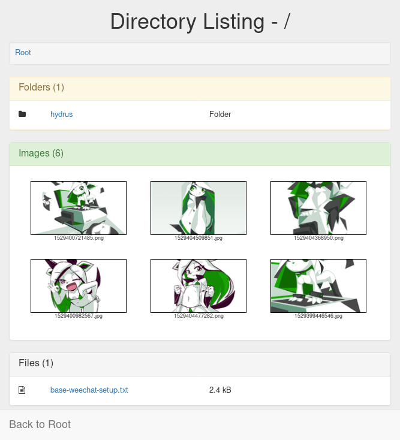
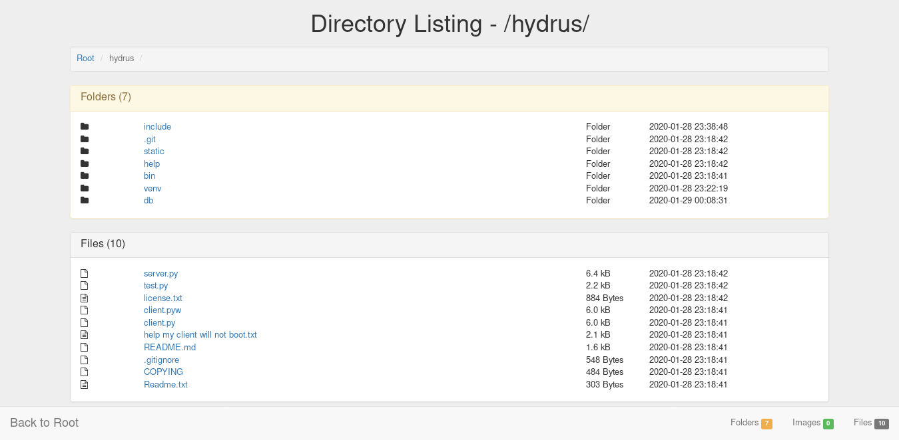

## keiDirList

unendingPattern's directory listing script.

Based on [garrys_dir_list.php](https://github.com/unendingPattern/garrys-dir-list) and [SPKZ's Directory Listing Script](https://github.com/MoNoLidThZ/DirScript).

  

**Features:**

* Simplistic
* Direct links
* Directory system with file counters
* File extension icons using FontAwesome
* Layout using Bootstrap
* Written in Python using Flask

**Installing & running:**
* `git clone https://github.com/unendingPattern/keiDirList.git`
* `cd keiDirList`
* `sh install.sh`
* Edit `config`
* Put some files into `./keiDirList/static/files`
* `sh run.sh` (http) 0.0.0.0:5000))
* or `sh uwgsi.sh` (socket) 0.0.0.0:6000))
* or `sh uwgsi-debug.sh` (http) 0.0.0.0:6000))
* ???
* Profit
